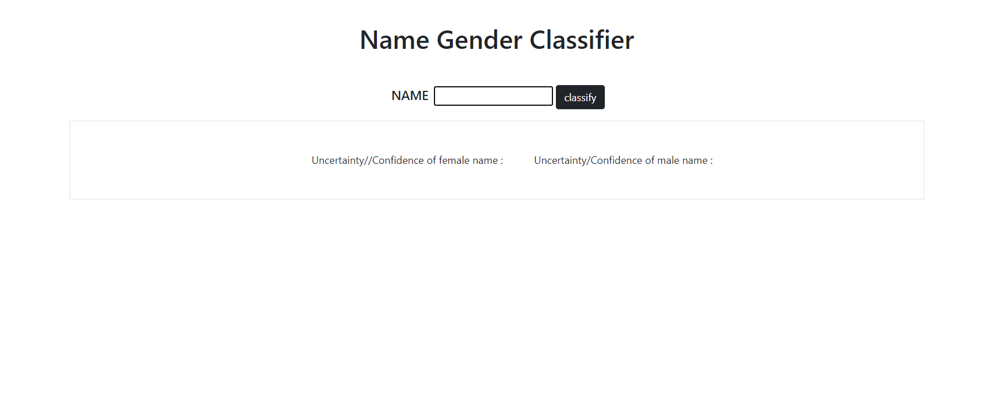

# GenderClassifierNN
A GenderClassifier built with python, served using FastAPI 

# Installation 
- Clone the project
- For installing dependencies, run ```pip install -r requirements.txt```
- Now, we need to train the model, for doing so run ```python3 classifier/train.py```
- For starting the uvicorn server, run ```uvicorn web.main:app```
- If we go to the localhost:8000, a frontend is present for using the classifier



# Usage
- Using frontend : 
  - A basic frontend for typing in names and getting classifications
- Using REST API 
  - for single name classification ```classify?name=<name>```
  - for multiple name classification ```bulk_classify?names=<name1>&names=<name2>```

**returns**
```
    {
      'name' : name being classified 
      'male'   :  Confidence/Uncertainty of being male
      'female' :  Confidence/Uncertainty of being female 
    }
```
  st : 
  
      male = 1 - female

# Model 

- The names are one hot encoded and fed to the neural net 
- The model is for now is a bidirectional stacked LSTM followed by a dense layer layer of size one 
- The output is passed through a sigmoid function, which makes it of value [0-1] (Zero begin female, One being male)
- The test accuracy of the model currently is roughly **87%**